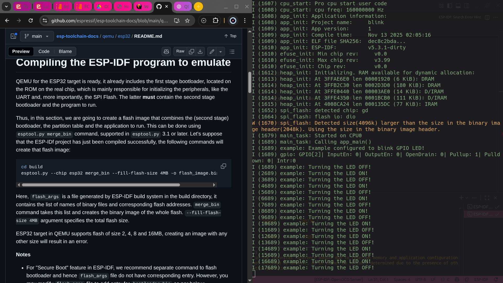
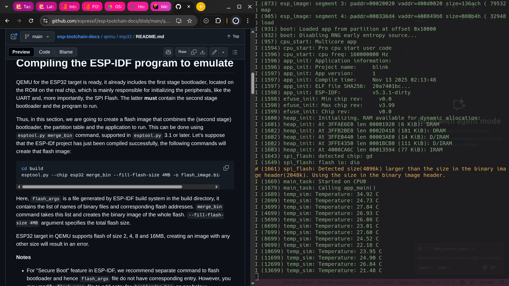

# FOSSEE IITB Open Source HardWare Screening Task  
**Author:** Akshat Sharma  

---

## **System Information**
| Component | Version |
|----------|---------|
| ESP-IDF  | v5.3.1 |
| QEMU     | v9.2.2 |
| OS       | Ubuntu 22.04 LTS |

---

# **1. Installing Ubuntu 22.04**

*(I already had Ubuntu installed; these are the standard installation steps.)*

## **1.1 Download Ubuntu ISO**
Get Ubuntu 22.04 (Jammy Jellyfish):  
https://releases.ubuntu.com/jammy/

## **1.2 Create Bootable USB**
Use any of the following:
- **Rufus** (Windows)
- **balenaEtcher** (Windows/Linux/macOS)
- **Startup Disk Creator** (Ubuntu)

## **1.3 Boot From USB**
1. Reboot the computer  
2. Enter BIOS/Boot Menu (**F12**, **F10**, **Esc**, varies by motherboard)  
3. Select the USB drive  

## **1.4 Install Ubuntu**
1. Select **Install Ubuntu**  
2. Choose your keyboard layout  
3. Choose **Minimal Installation**  
4. Enable **Download updates while installing**  
5. Choose disk partitioning method  
6. Install and reboot  

---

# **2. Prerequisites (Linux)**

Install required packages:

```bash
sudo apt update
sudo apt install -y git python3 python3-pip cmake make gcc g++     libgcrypt20-dev libglib2.0-dev libpixman-1-dev libslirp-dev build-essential
```

---

# **3. Install ESP-IDF**

## **3.1 Clone ESP-IDF**
```bash
mkdir -p ~/esp
cd ~/esp
git clone --recursive https://github.com/espressif/esp-idf.git
cd esp-idf
```

## **3.2 Install Tools**
```bash
./install.sh esp32
```

## **3.3 Export Environment**
```bash
echo ". $HOME/esp/v5.3.1/esp-idf/export.sh" >> ~/.bashrc
source ~/.bashrc
```
For frequent usage, an alias can also be set like so:
```bash
alias get_idf='. $HOME/esp/v5.3.1/esp-idf/export.sh'
```

## **3.4 Verify**
```bash
idf.py --version
```

---

# **4. Install QEMU for ESP32 (xtensa-softmmu)**

## **4.1 Clone Espressif QEMU**
```bash
cd ~/esp
git clone https://github.com/espressif/qemu.git
cd qemu
```

## **4.2 Build QEMU**
```bash
mkdir build
cd build
../configure --target-list=xtensa-softmmu
make -j$(nproc)
make install
```

## **4.3 Verify Installation**
```bash
qemu-system-xtensa
```


---

# **5. Build & Run ESP-IDF Projects**

## **5.1 Create Blink Project**
```bash
cd ~/esp
cp -r esp-idf/examples/get-started/blink ./blink
cd blink
idf.py set-target esp32
idf.py build
```

## **5.2 Run Blink in QEMU**
```bash
qemu-system-xtensa -nographic -machine esp32   -drive file=build/blink.elf,if=mtd,format=raw
```

Expected output:
Serial monitor should show text indicating LED turning ON and OFF.




---

# **6. Simulated Temperature Sensor Example**

## **6.1 main.c**
```c
#include <stdio.h>
#include "freertos/FreeRTOS.h"
#include "freertos/task.h"
#include "esp_random.h"

void app_main() {
    while (1) {
        float temp = 20.0 + (esp_random() % 1000)/100.0;
        printf("Temperature: %.2f C
", temp);
        vTaskDelay(1000 / portTICK_PERIOD_MS);
    }
}
```

Build:
```bash
idf.py build
```

Run:
```bash
qemu-system-xtensa -nographic -machine esp32   -drive file=build/<project>.elf,if=mtd,format=raw
```


---

# **7. Challenges & Fixes**

## **7.1 QEMU Flash Size Error**

Running certain ESP-IDF projects shows:

```
Error: only 2, 4, 8, 16 MB are supported
```

This happens because QEMU requires a **merged flash image** instead of a raw ELF when flash size doesn’t match the allowed values.

### **Fix: Create a merged flash image**

```bash
cd build
esptool.py --chip esp32 merge_bin --fill-flash-size 4MB     -o flash_image.bin @flash_args
```

### **Run with QEMU:**
```bash
qemu-system-xtensa -nographic -machine esp32   -drive file=flash_image.bin,if=mtd,format=raw
```

Reference:  
https://github.com/espressif/esp-toolchain-docs/blob/main/qemu/esp32/README.md

---

## **7.2 Other Issues**

| Issue | Fix |
|------|-----|
| Python version mismatch | Use Python ≥ 3.10 |
| Missing QEMU build dependencies | Install Pixman, GLib, Gcrypt, Slirp |
| ESP-IDF tools not found | Re-run `export.sh` |

---

# **8. Yaksh Integration**

This setup could enable:
- Compiling ESP-IDF code for evaluation against test cases.
- Experimentation on firmware without the need for hardware.
- Practice exercises and tests.
- Integrated serial console to debug the solutions for the students. 
- Automatic grading system for students.  

---

# **9. References**

- QEMU Docs — https://www.qemu.org/docs/master/  
- Espressif QEMU — https://github.com/espressif/qemu  
- ESP-IDF Guide — https://docs.espressif.com/projects/esp-idf/  
- Yaksh — https://github.com/FOSSEE/online_test  
- ESP-IDF Examples — https://github.com/espressif/esp-idf/tree/master/examples/get-started  

---

# **End of Report**